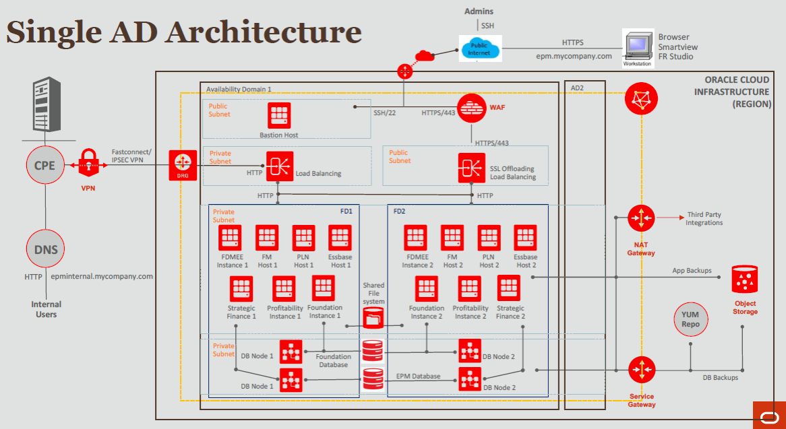

# Introduction

## About this Workshop

This workshop is focusing on setting up Hyperion modules on Oracle cloud infrastructure. 

Estimated Lab Time: 5-6 hours -- this estimate is for the entire workshop - it is the sum of the estimates provided for each of the labs included in the workshop.

Notes:

The workshop is quite detailed and technical. PLEASE take your time and DO NOT skip any steps.
IP addresses and URLs in the screenshots in this workbook may differ from what you use in the labs as these are dynamically generated.
For security purposes, some sensitive text (such as IP addresses) may be redacted in the screenshots in this workbook.

## Workshop Overview

The following figure (W-1) outlines the workshop architecture. Figure W-1: Workshop Architecture

1. Oracle Hyperion Foundation Services

Common infrastructure components that enable you to install and configure all the modules of the Enterprise Performance Management system; and to manage users, security, metadata, and the life cycle of the applications. Foundation Services are necessary regardless of whether you want to deploy Hyperion Financial Management, or Hyperion Planning, or both.

2. Oracle Hyperion Financial Management (HFM)

A multidimensional online analytical processing server on RDBMS that provides an environment for web-based consolidation, tax provision, QMR, JSK applications. The application enables global financial consolidation, reporting, and analysis in a single, highly scalable software solution.

3. Oracle Hyperion Tax Provision (HTP)

A comprehensive global tax provision solution for multinational companies reporting under US GAAP or IFRS. The application encompasses all the stages of the corporate tax provision process, including tax automation, data collection, tax provision calculation, return-to-accrual automation, and tax reporting and analysis.
The application is built using Oracle Hyperion Financial Management, and it leverages all the functionality provided by Financial Management.

4. Oracle Hyperion Planning

A centralized, Excel and web-based planning, budgeting, and forecasting solution that integrates financial and operational planning processes and improves business predictability.

5. Oracle Hyperion Financial Data Quality Management, Enterprise Edition (FDMEE)

A packaged solution that helps finance users develop standardized financial data management processes by using a web-based guided workflow.

6.Oracle Hyperion Strategic Finance
     
A financial forecasting and modeling solution with on-the-fly scenario analysis and modeling capabilities, which helps you quickly model and evaluate financial scenarios, and offers out of the box treasury capabilities for sophisticated debt and capital structure management.

7. Oracle Hyperion Profitability and Cost Management

An application that provides actionable insights, by discovering drivers of cost and profitability, empowering users with visibility and flexibility, and improving resource alignment.

## Acknowledgements
* **Author** - <Name, Title, Group>
* **Contributors** -  <Name, Group> -- optional
* **Last Updated By/Date** - <Name, Group, Month Year>
* **Workshop (or Lab) Expiry Date** - <Month Year> -- optional, use this when you are using a Pre-Authorized Request (PAR) URL to an object in Oracle Object Store.

## See an issue?
Please submit feedback using this [form](https://apexapps.oracle.com/pls/apex/f?p=133:1:::::P1_FEEDBACK:1). Please include the *workshop name*, *lab* and *step* in your request.  If you don't see the workshop name listed, please enter it manually. If you would like us to follow up with you, enter your email in the *Feedback Comments* section.
