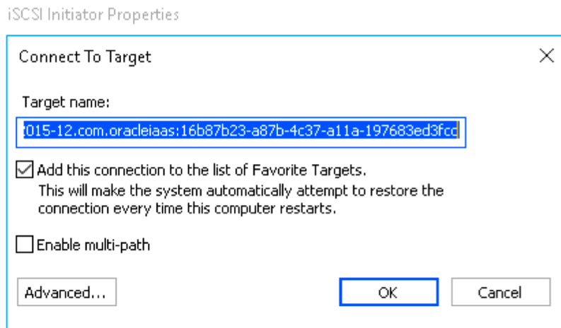

# Preparing the Instances

## Introduction

This lab walks you through the steps to preparing the Windows compute instances for running Hyperion on OCI. We will be creating shared drive to be accessed across all the compute instances, download all the required tools, and the HFM installation files from e-delivery. 

Estimated Lab Time: 40 minutes

### Objectives

In this lab, you will:
* Create Block volume 
*	Mount and Attach (Have to try using paravirtualized instead)
*	Download required files on shared drive and make sure all compute boxes are able to access it. 
a.	SQL Developer
b.	Notepad ++
c.	All HFM installation from edelivery
d.	Firefox ESR

### Prerequisites
a. Enable the required ports in the security list. (edit)

## **STEP 1**: Setting up a shared drive on the foundation server. 
1.	Create a shareable block volume on OCI. Login to OCI -> Click on left hamburger menu -> Block Storage -> Block Volume. 
2.	Click on Create Block Volume. 
 
 

3.	Enter the name for the block volume – EPMSharedDrive. Leave all the other settings to default and click on Create Block Volume. 

4.	Once the volume is created, click on Attached Instances under the Resources heading, click on Attach to Instance. Select ISCSI under Attachment Type. Select Read/Write – Shareable under Access Type. 

5.	Check the checkbox – 
I understand that data might become corrupted if the volume is used before a clustered file system is installed and configured.
6.	Select the instance – epmfndash11 from the dropdown and click on Attach. 
 

7.	Repeat this step of attaching the block volume for the other two instances – epmwebash11, epmhfmash11
 

8.	After mounting the shared drive on all three instances, you will have to login to all the three Windows compute boxes individually, as done on previous lab, and connect the volume to the instances. To attach the block volume to the compute instance, follow the steps –

     a.	Open the navigation menu. Under Core Infrastructure, go to Compute and click Instances. 

     b.	Click your instance name to view the instance details.

     c.	In the Resources section, click Attached Block Volumes.

     d.	Click the Actions icon (three dots) next to the volume you just attached and then click iSCSI Commands and Information. The iSCSI Commands and Information        dialog box opens. Notice that the dialog box displays specific identifying information about your volume (such as IP address and port) as well as the iSCSI          commands that you can use.

     e.	On your Windows instance, open the iSCSI Initiator - Open Server Manager, click Tools, and select iSCSI Initiator.
 
     

     f.	In the iSCSI Initiator Properties dialog box, click the Discovery tab. Click Discover Portal.

     

     g.	Enter the block volume IP address retrieved from the console in previous step and port. Click OK.

     

     h.	Click the Targets tab. In the Discovered Targets region, select the volume IQN.

     
 
     i.	Click Connect and then click OK to close the dialog.

     

     
 
     j.	You are now ready to format (if needed) and mount the volume. To get a list of mountable iSCSI devices on the instance, in Server Manager, click File and Storage Services and then click Disks.

     
 
     k.	You will now see the 1.00 TB driver that we have just mounted on the list. 

     

     l.	Right click on the drive and click on New Volume.  

     

     m.	Select the disk from the list and click on Next. And click OK on the dialog box.

     
 
     n.	Leave the settings to default on the size screen.  Click on Next.

     
 
     o.	Assign a Drive letter on the prompt.

     
 
     p.	Click Next. Choose the file system as NTFS and assign a Volume label as EPMSharedDrive and click on Next.

     
 
     q.	On the confirmation page, make sure all the settings are correct and hit create button. 

     
 
     r.	Once all the processes are completed successfully, click on close button.  

     			
 
     s.	You can confirm the drive is mounted by checking the folders in your file explorer. Repeat this exercise for the other Windows instance of web and app tier. 

     

NOTE: - The steps to create, attach, and connect to the block volume is given at the URL - [HERE](https://docs.cloud.oracle.com/en-us/iaas/Content/GSG/Tasks/addingstorageForWindows.html)

## **STEP 2**: Mount the Block volume to the Linux bastian host

Follow the steps provided on this link to mount the block volume to your linux system - [HERE](https://docs.cloud.oracle.com/en-us/iaas/Content/GSG/Tasks/addingstorage.htm) under "Attaching the Volume to an Instance"

## **STEP 3**: Download required files and tools for HFM installation

You will require to install SQL Developer, Notepad++, HFM installation files, Firefox ESR to run this lab. Login to your Linux sytem on VNC viewer and go to Firefox to download the following.

1. SQL Developer for Windows - [HERE](https://www.oracle.com/in/tools/downloads/sqldev-v192-downloads.html) Download the package "Windows 64-bit with JDK 8 included".
2. Notepad ++ for Windows - [HERE](https://notepad-plus-plus.org/downloads/v7.0/) Download the package "Notepad++ 7 - 64 bits"
3. For the EPM installation file, go to the link - [HERE](https://edelivery.oracle.com/) and search for Oracle Hyperion Financial Management Plus 11.2.3.0.000. Extract all these files to a single folder and move it to the shared folder.
4. Download Firefox ESR using the link - [HERE](https://www.mozilla.org/en-US/firefox/enterprise/)

Add all the downloaded files at the shared drive location on Linux system.

Reboot all the 4 compute instances of Linux and Windows. 

When you reboot all the instances, the shared drive on Windows system should see the downloaded files.

You can now proceed to next lab.

## Acknowledgements
* **Author** - Mitsu Mehta, Cloud Engineering
* **Contributors** - Rojal Bhadke, Software Development Director, EPM Consolidation
* **Last Updated By/Date** - Mitsu Mehta, Cloud Engineering, December 2020

## See an issue?
Please submit feedback using this [form](https://apexapps.oracle.com/pls/apex/f?p=133:1:::::P1_FEEDBACK:1). Please include the *workshop name*, *lab* and *step* in your request.  If you don't see the workshop name listed, please enter it manually. If you would like us to follow up with you, enter your email in the *Feedback Comments* section.

