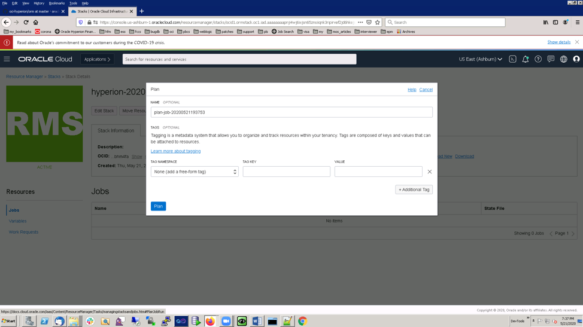

# Provision an Instance

## Introduction

This lab walks you through the steps to provision all the required resources for running Hyperion on OCI using a resource manager package

Estimated Lab Time: 40 minutes

### Objectives

In this lab, you will:
* Download the zip folder for HFM installation on OCI
* Run resource manager to provision the environment

### Prerequisites

* An Oracle Free Tier, Always Free, Paid or LiveLabs Cloud Account
* Tenancy Admin User
* Tenancy Admin Password

## **STEP 1**: Download the resource manager package 

Go the URL and download the oci-hyperion.zip folder from this link - [HERE](https://objectstorage.us-ashburn-1.oraclecloud.com/p/6H2YLXgEPIxrIaL0ZjcEqa4-HcPbz2vK00_ZYT2L6aEyAPYVF9CoeAMkAHs4K74w/n/ociateam/b/Hyperion-HOL/o/oci-hyperion.zip)

## **STEP 2:** Create OCI infrastructure using terraform configuration file

1.	Login to OCI

2.	Go to Menu -> Resource Manger -> Stacks

3.	Click on Create Stack

 
4.	Browse or drop oci-hyperion.zip configuration file downloaded in the previous step. Provide the name as HyperionHOL and Description as Hyperion on OCI. Select the compartment where you want to provision all your resources.

 
5.	Click Next. Provide a public SSH key. Select the Availability Domain

6.	Select an EPM Application. In this case we have selected Financial Management. Select Number of Nodes for an application. Select Instance Shape, Volume Size and Volume performance.

7.	Select the Number of Instance shape Volume Size and Volume performance for the Foundation server.

8.	Select Create EPM Database. - Select the DB Node, Shape and DB Size. 

9.	Select the Web Server Configuration

10.	Load Balance Configuration

11.	Click Next. Go through the summary of the selection and confirm your selection.

12.	Click on Create

13.	Click on Terraform Actions -> Click on Plan

14. Notice that Plan is in progress. Once the Plan Succeeded, go back to Stack Details. Notice that you plan is listed in succeeded status.

15.	Click on Terraform Actions -> Click on Apply

16. Notice that the plan will be in Accepted state. Plan is in progress.

17.	Once it completes, Apply state will be succeeded and all the instance will have assigned host, ips , user and password.

You can click on the Outputs option under Resources on the left pane. Record all the IPs and default passwords for the compute instances. 

You may proceed to the next lab.

## Acknowledgements
* **Author** - Mitsu Mehta, Cloud Engineering
* **Contributors** - Rojal Bhadke, Software Development Director, EPM Consolidation
* **Last Updated By/Date** - Mitsu Mehta, Cloud Engineering, December 2020

## See an issue?
Please submit feedback using this [form](https://apexapps.oracle.com/pls/apex/f?p=133:1:::::P1_FEEDBACK:1). Please include the *workshop name*, *lab* and *step* in your request.  If you don't see the workshop name listed, please enter it manually. If you would like us to follow up with you, enter your email in the *Feedback Comments* section.
