# Setup the Environment

## Introduction

This lab will setup the Linux and Windows instances provisioned in previous lab. We will enable the required ports, and install the tools required to access the environments provisioned. 

Estimated Lab Time: 20 minutes

### Objectives

In this lab, you will:
* Open the required ports on app, db, and web security lists
* Download and install VNC viewer and Reminna to SSH and RDP into the app servers
* Login to reset and verify to all 3 Windows compute instances that are going to be used for HFM, FDMEE, and Foundation server respectively.

### Prerequisites

To perform the lab, you will need - 

* Tenancy username 
* Tenancy password
* Private-key of the SSH key bundle used in the previous lab while provisioning the instances. 
* Public IP address of the Linux host noted down in the previous lab
* Default passwords and IP address of the Windows hosts.

## **STEP 1**: Installing TigerVNC to the Linux host

1. Login to your OCI account and click on the hamburger menu on the top left corner –> Click on Compute -> Click on Instances. 

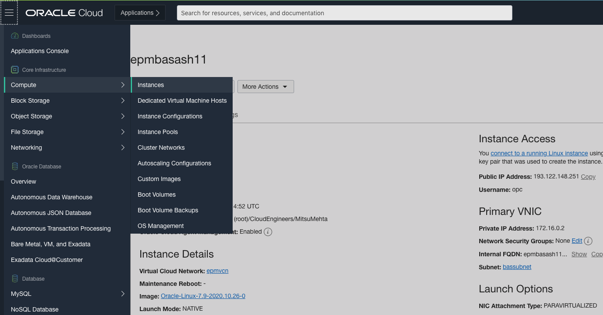

2. Click on the epmbasash11 instance and copy the public IP address.

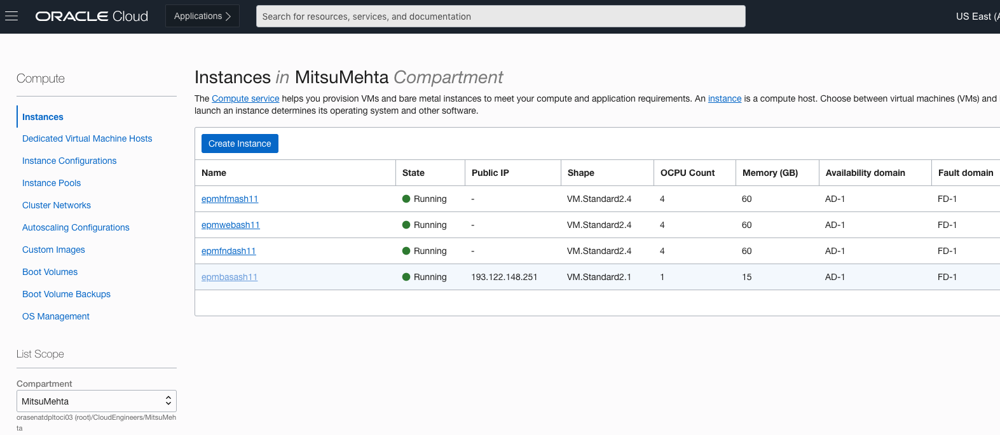

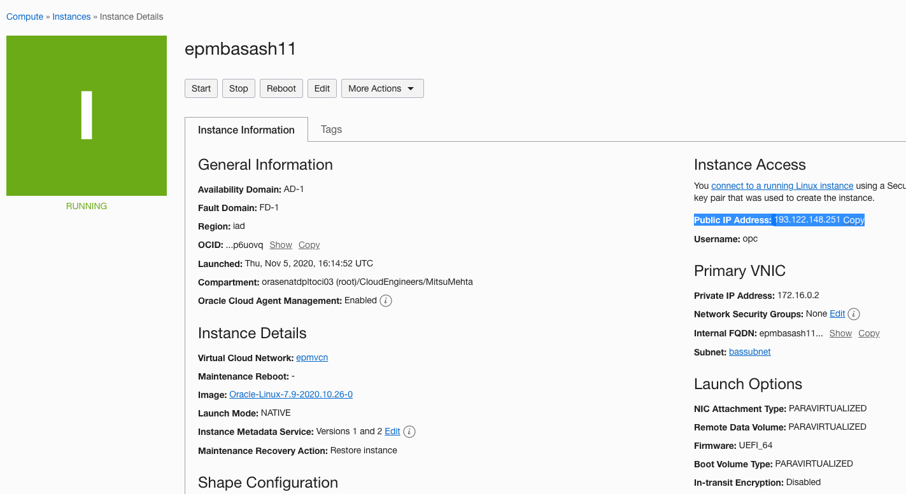

3. Open your terminal on your local system and login to the Linux bastion host using the command – 

   ``ssh -i <path_of_the_private_key> opc@<public_IP_address>``

   *e.g. ssh -i /Users/mimehta/Desktop/sshkeybundle/privateKey opc@193.122.148.251*

   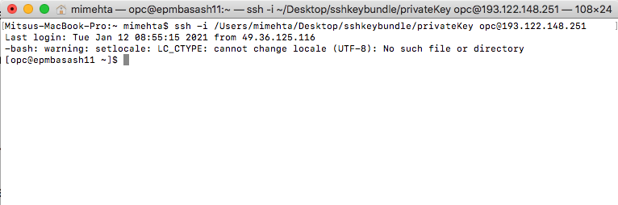

4. Once you are logged in to the server, 

   a. Install gnome-desktop, using the command – 

      `` sudo yum groupinstall "gnome-desktop" -y ``

      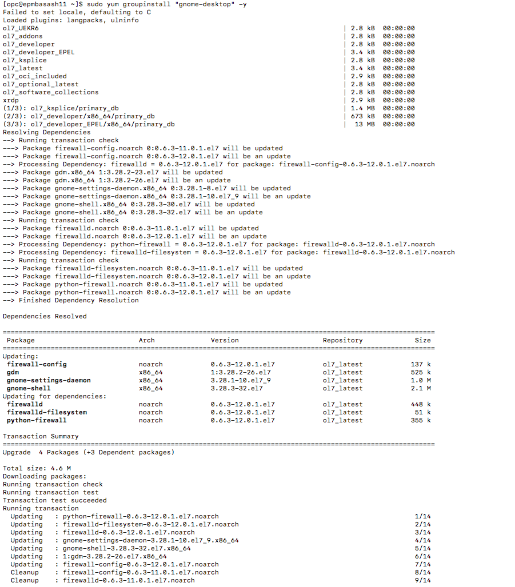

   b. Install tigervnc-server, using the command – 

      `` sudo yum install "tigervnc-server" -y `` 

      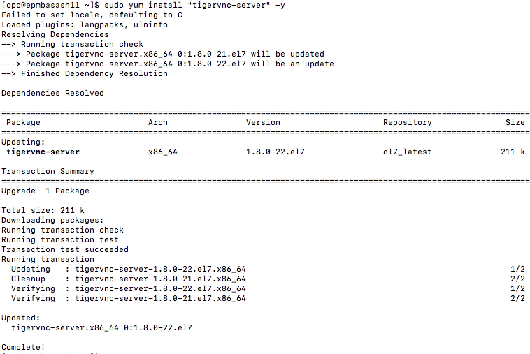

   c. Install remmina using the command 	

      `` sudo yum install remmina``

      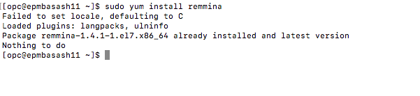

   d. Install Firefox using the command 	

      `` sudo yum install firefox ``

      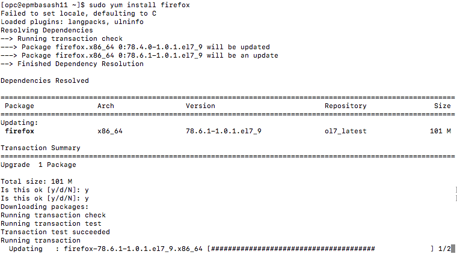

5. Enter the following command – 

      `` vncserver``

      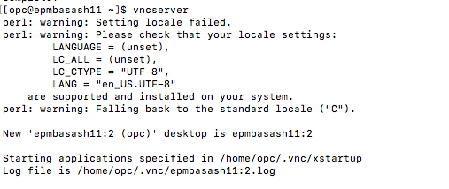
      
6. You will be prompted to set up a password for the vncserver. You can set the password as **Welcome#1234**. Confirm the password for second time.

7. On a new terminal window, enter the following command for port forwarding. 

   `` ssh -i <path_of_the_private_key> -L 5901:127.0.0.1:5901 opc@<public_IP_address>``
   
   *e.g. ssh -i /Users/mimehta/Desktop/sshkeybundle/privateKey -L 5901:127.0.0.1:5901 opc@193.122.148.251*

   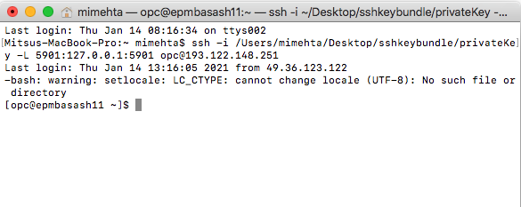

8. Open the VNC viewer and enter the value in the text bar as **localhost:5901**

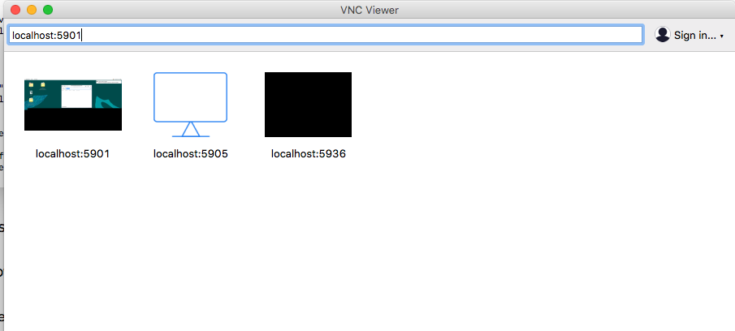

You will be prompted to continue to authenticate. Enter the password you set in step 6 - Welcome#1234 and hit enter.

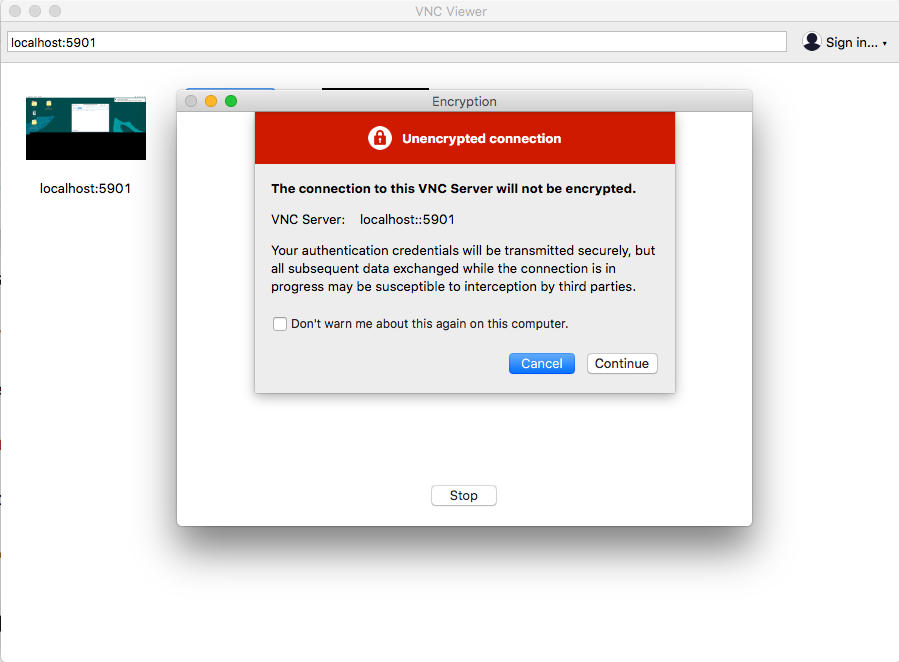

9. You should now be able to see the Desktop of the Linux instance on VNC viewer. 

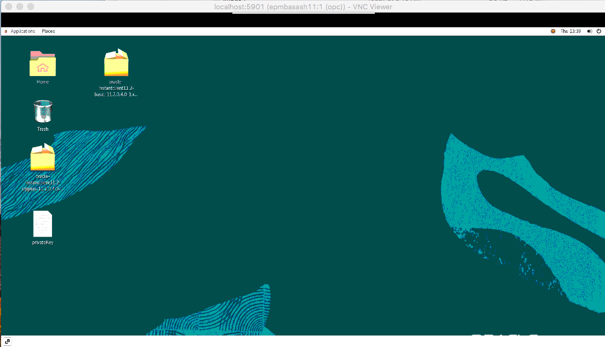

## **STEP 2:** Setting up the Windows systems

1. We will now setup and verify the three Windows compute instances provisioned. To log into the private IP address of EPM web, HFM, and foundation servers, you need the private IP address of these instances. Retrieve the IP address from OCI console -> Left top Hamburger menu -> Compute -> Instances. Navigate to the compartment and region where you have provisioned the resources and take a note of the IP address for all three servers - **epmfndash11, emphfmash11, epmwebash11**

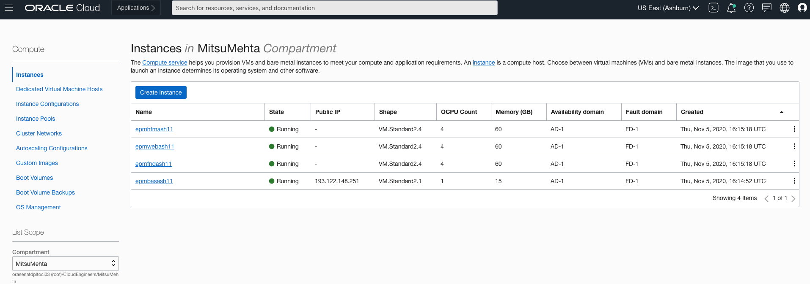

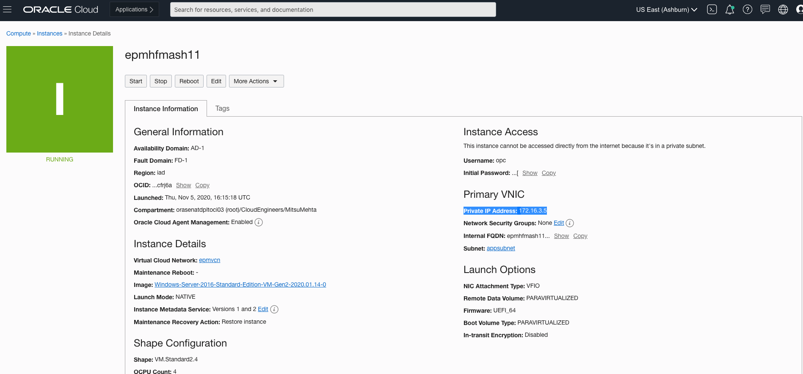

2. Make a note of the Initial password of all three instances.

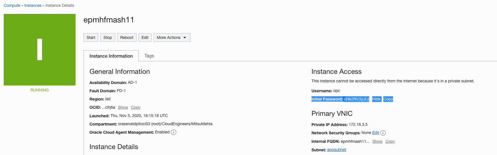

3. Now go back to the Tiger VNC viewer, open Remmina application from the application list. Click on Application -> Internet -> Remmina. 

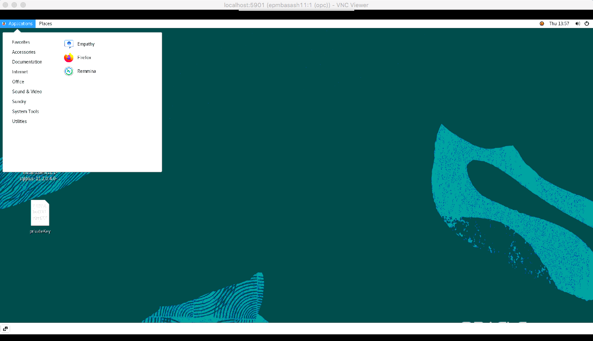

4. Select RDP from the list of protocols, Enter the private IP address of the epmfndash11 in the text box and hit enter. You will be prompted to enter the initial password that you have taken a note of. 

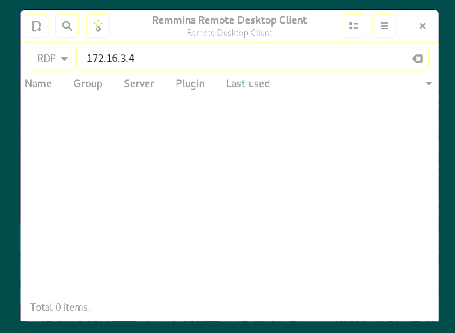
 
5. On this step you will have to reset the password for the Windows instance. For this exercise, keep the standard password as **Welcome#1234**.

6. Repeat this exercise for the other two Windows instances - emphfmash11, epmwebash11.

Once you have verified login for all the compute instances, you can proceed to the next lab.

## Acknowledgements
* **Author** - Mitsu Mehta, Cloud Engineering
* **Contributors** - Rojal Bhadke, Software Development Director, EPM Consolidation
* **Last Updated By/Date** - Mitsu Mehta, Cloud Engineering, December 2020

## See an issue?
Please submit feedback using this [form](https://apexapps.oracle.com/pls/apex/f?p=133:1:::::P1_FEEDBACK:1). Please include the *workshop name*, *lab* and *step* in your request.  If you don't see the workshop name listed, please enter it manually. If you would like us to follow up with you, enter your email in the *Feedback Comments* section.
